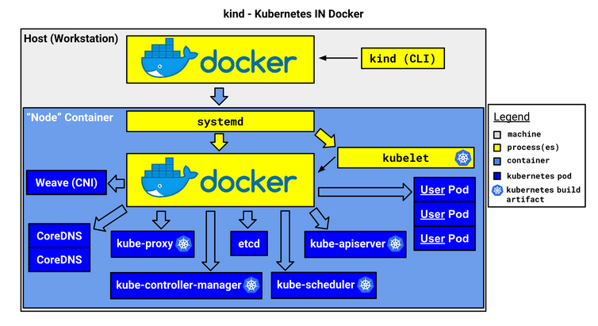
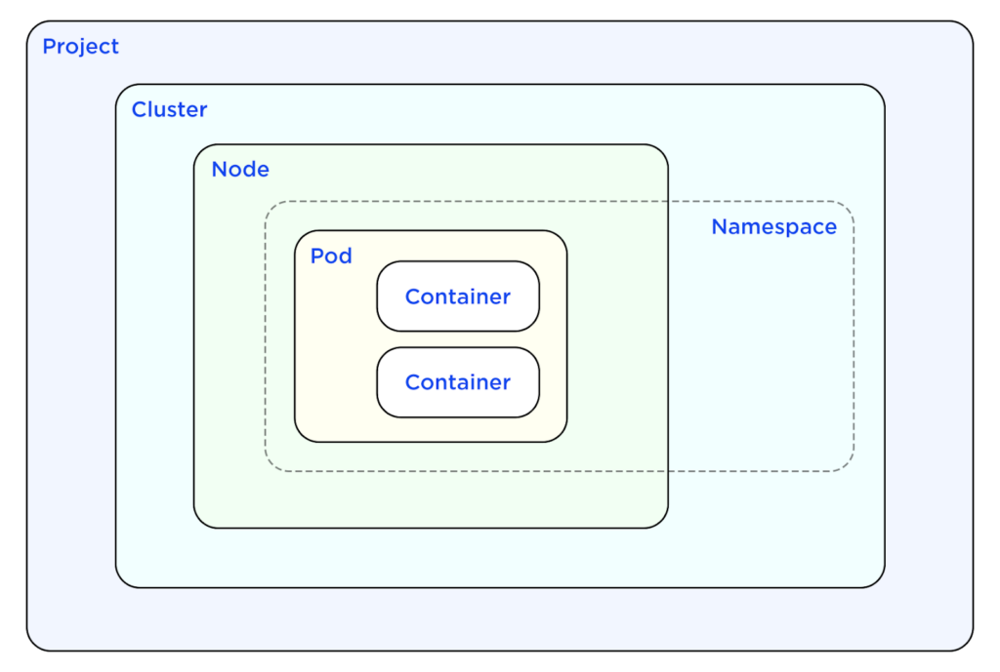

# Glossário de Tecnologias Relacionadas ao ESO.

Este Glossário está organizado em ordem alfabética. 

--- 

??? note "Cluster"

    - **O que é?**  
      
        É um conjunto de nós (computadores) que executam cargas de trabalho no Kubernetes, isto é, executar aplicações em container.

        É uma técnica que agrupa vários recursos computacionais em uma única unidade lógica. Esses recursos são conectados em rede e trabalham em conjunto para executar tarefas, processar dados e armazenar informações de maneira a melhorar o desempenho de aplicações, garantir alta disponibilidade, reduzir custos e aumentar a escalabilidade, já que os recursos podem ser compartilhados e distribuídos de maneira eficiente para atender às demandas da aplicação em tempo real. Cada computador é um “nó”, sendo que não há limites de quantos nós podem ser interligados. 

        O cluster é o que proporciona a principal vantagem do Kubernetes: a capacidade de programar e executar containers em um conjunto de máquinas físicas, virtuais, on-premise ou na nuvem. Os containers do Kubernetes não estão vinculados a máquinas individuais. Na verdade, eles são abstraídos em todo o cluster.

    - **Para que serve?**  
      O cluster tem a função de agrupar várias máquinas em um sistema único e eficiente, permitindo que aplicações distribuídas sejam executadas com maior desempenho e escalabilidade. No Kubernetes, ele facilita o gerenciamento de containers de forma a reduzir a complexidade, garantir alta disponibilidade e reduzir custos. O cluster Kubernetes geralmente possui um nó principal que gerencia os pods e o ambiente de execução do sistema.

    - **Links úteis:**  
      - [Introdução aos Clusters](https://kubernetes.io/docs/concepts/cluster-administration/)
      - [O que é um cluster do Kubernetes?](https://aws.amazon.com/pt/what-is/kubernetes-cluster/)
      - [Kubernetes Clusters: Everything You Need To Know](https://www.atatus.com/blog/kubernetes-clusters-everything-you-need-to-know/)

---

??? note "Docker"

    - **O que é?**  
      Docker é uma plataforma aberta para o desenvolvimento, envio e execução de aplicações. Ele permite que você separe suas aplicações da infraestrutura, facilitando a entrega de software de forma rápida e eficiente, permitindo criar, compartilhar e executar aplicações e microsserviços containerizados.

    - **Para que serve?**  
      Possibilita a gestão da infraestrutura ,utilizando suas metodologias para envio, teste e implantação de código. Com isso, é possível reduzir significativamente o tempo entre a escrita do código e a sua execução em produção.
      Ele simplifica processos complexos, como mapeamento de portas, preocupações com o sistema de arquivos e outras configurações padrão, permitindo que o foco seja na escrita de código.
      Com ele, é possível desenvolver a aplicação e seus componentes de apoio usando containers. Neste contexto, o container se torna a unidade para distribuir e testar a aplicação. Quando estiver pronto, é possível implantar a aplicação no ambiente de produção, seja ele local, na nuvem ou híbrido.

    - **Links úteis:**  
      - [Documentação oficial](https://docs.docker.com/)

---

??? note "ESO - External Secrets Operator"

    - **O que é?**  
      É um operador do Kubernetes que integra sistemas de gerenciamento de segredos externos (como AWS Secrets Manager, HashiCorp Vault, Google Secrets Manager, Azure Key Vault, IBM Cloud Secrets Manager, CyberArk Conjur, Pulumi ESC, entre outros). O operador lê informações das APIs externas e injeta automaticamente os valores nos segredos do Kubernetes, permitindo sincronizar dados confidenciais de provedores externos.

    - **Para que serve?**  
      Automatiza a sincronização de segredos de APIs externas com os clusters Kubernetes, garantindo segurança e eficiência na gestão de credenciais.
    O ESO é composto por um conjunto de recursos personalizados de API — ExternalSecret, SecretStore e ClusterSecretStore — que fornecem uma abstração amigável para a API externa que armazena e gerencia o ciclo de vida dos segredos para você. Isso facilita a gestão de segredos no Kubernetes ao integrá-los de maneira automática com os provedores externos de segredos.

    - **Links úteis:**  
      - [Documentação oficial](https://external-secrets.io/)

---

??? note "Go"

    - **O que é?**  
      Uma linguagem de programação de código aberto criada pelo Google, conhecida pela simplicidade, desempenho, clareza e concisão.
    - **Para que serve?**  
      Usada no desenvolvimento de aplicativos, sistemas de backend e ferramentas, especialmente em ambientes de cloud e Kubernetes.
      É uma linguagem que oferece mecanismos de concorrência que facilitam a escrita de programas capazes de aproveitar ao máximo máquinas com múltiplos núcleos e redes, enquanto seu sistema de tipos inovador permite a construção de programas flexíveis e modulares. Go compila rapidamente para código de máquina e, ao mesmo tempo, oferece conveniência com coleta de lixo e o poder da reflexão em tempo de execução. É uma linguagem compilada, estaticamente tipada, que tem a agilidade de linguagens dinamicamente tipadas e interpretadas.
    - **Links úteis:**  
      - [Documentação oficial](https://go.dev/doc/)

---

??? note "Helm"

    - **O que é?**  
      Um gerenciador de pacotes para Kubernetes que facilita a implantação e o gerenciamento de aplicações usando templates chamados "charts".
    - **Para que serve?**  
      Simplifica a configuração, instalação e atualização de aplicativos no Kubernetes.
    - **Links úteis:**  
      - [Documentação oficial](https://helm.sh/docs/)
      - [GitHub do projeto](https://github.com/helm/helm)

---

??? note "HPA"

    - **O que é?**  
    Horizontal Pod Autoscaler (HPA)
    - **Para que serve?**  
      É usado para controlar a quantidade de Pods que há em um Deployment. Por exemplo, se o uso de CPU estiver muito alto, o HPA aumentaria a quantidade de pods. Também é possível utilizar o Vertical Pod Autoscaler (VPA), que aumentaria a quantidade de recursos de cada pod em vez de aumentar a quantidade de Pod.
      
      Fonte:  [Leo Michalski](https://github.com/leomichalski/kubernetes-para-devs/blob/main/README.md)

---

??? note "Ingress"

    - **O que é?**  
      Em um cluster Kubernetes no qual todas as requisições chegam no mesmo IP e na mesma porta, os Ingresses são responsáveis por direcionar (de acordo com o DNS e o endpoint de cada requisição) essas requisições para os Services adequados. Também pode ser usado para outras finalidades.
      
      Fonte:  [Leo Michalski](https://github.com/leomichalski/kubernetes-para-devs/blob/main/README.md)

    - **Para que serve?**  
      Oferece um ponto de entrada único para rotear tráfego para serviços internos.
    - **Links úteis:**  
      - [Sobre Ingress](https://kubernetes.io/docs/concepts/services-networking/ingress/)

---

??? note "Issuer"

    - **O que é?**  
      Um componente em ferramentas como o Cert-Manager para emitir certificados.
    - **Para que serve?**  
      Gerencia a emissão de certificados TLS automáticos para serviços em Kubernetes.Ele que emite o certificado SSL para os Ingresses poderem criptografar (com HTTPS) as requisições que entram e saem, por exemplo.

    - **Links úteis:**  
      - [Documentação do Cert-Manager](https://cert-manager.io/docs/)

---

??? note "Kind"

    - **O que é?** 
      É uma ferramenta para executar clusters Kubernetes locais usando contêineres Docker como "nós" do cluster.
    - **Para que serve?**  
      O Kind foi projetado inicialmente para testar o próprio Kubernetes, mas também pode ser utilizado para desenvolvimento local ou integração contínua (CI). Ele permite criar clusters Kubernetes de forma simples em ambientes locais, facilitando testes e desenvolvimento sem a necessidade de infraestrutura complexa.
        
    - **Links úteis:**  
      - [Site oficial](https://kind.sigs.k8s.io/)

    
<b>Imagem 2</b> - kind - Kubernetes no Docker

    

    
<b>Fonte</b>: <a href="https://kind.sigs.k8s.io/docs/design/initial/">Kind</a>

---

??? note "Kubectl"

    - **O que é?**  
      O kubectl é uma ferramenta de linha de comando para se comunicar com o plano de controle de um cluster Kubernetes, utilizando a API do Kubernetes.
    - **Para que serve?**  
      Executa operações no Kubernetes, como criar pods e monitorar o status do cluster.
      Permite que você interaja com o cluster Kubernetes, realizando operações como criação, gerenciamento e visualização de recursos. Ele busca um arquivo de configuração chamado config no diretório $HOME/.kube, que contém as informações sobre como se conectar ao cluster.

    - **Links úteis:**  
      - [Documentação oficial - Kubernetes](https://kubernetes.io/docs/reference/kubectl/)

---

??? note "Kubernetes"
    - **O que é?**  
      Uma plataforma de orquestração de contêineres que automatiza a implantação, escala e gerenciamento de aplicativos. É Open Source.
    - **Para que serve?**  
      Garante alta disponibilidade, escalabilidade e monitoramento de aplicações em contêineres.
    - **Links úteis:**  
      - [Documentação oficial](https://kubernetes.io/docs/)
      - [GitHub do projeto](https://github.com/kubernetes/kubernetes)

---

??? note "Nginx"
    - **O que é?**  
      É um servidor web HTTP de código aberto que também pode funcionar como proxy reverso, balanceador de carga, cache de conteúdo, servidor proxy TCP/UDP e servidor proxy de e-mail. É amplamente utilizado devido à sua alta performance e capacidade de gerenciar grandes volumes de tráfego.

    - **Para que serve?**  
      O Nginx é utilizado para servir conteúdos web, gerenciar tráfego de rede e balancear a carga entre servidores, além de atuar como proxy reverso e cache de conteúdo. Ele pode ser usado para melhorar a escalabilidade e a performance de aplicações web, distribuindo eficientemente as requisições entre múltiplos servidores.
      Possui um processo principal que gerencia a configuração e vários processos de trabalho que fazem o processamento das requisições. Ele distribui as requisições de forma eficiente, e o número de processos de trabalho pode ser ajustado de acordo com o número de núcleos do processador.

    - **Links úteis:** 
      - [Documentação oficial](https://nginx.org/en/docs/)  

--- 

??? note "Lint"
    - **O que é?**  
      Um processo de análise estática do código para identificar erros, problemas de estilo e  inconformidades com as melhores práticas de codificação.
    - **Para que serve?**  
      Serve para garantir a qualidade, consistência e a conformidade do código com padrões predefinidos, ajudando a identificar erros de sintaxe, problemas de formatação e más práticas de desenvolvimento antes da execução do código. Ele contribui para a manutenção de um código limpo, legível e eficiente.
    - **Links úteis:**  
      - [Introdução ao linting](https://eslint.org/)

---

??? note "Pods"
    - **O que é?**  
      A menor unidade de computação em Kubernetes, que agrupa um ou mais contêineres.
    - **Para que serve?**  
      Gerencia contêineres que compartilham recursos e atuam como uma única entidade em um cluster.
    - **Links úteis:**  
      - [Sobre Pods](https://kubernetes.io/docs/concepts/workloads/pods/)

    
<b>Imagem 3</b> - Organização dos Pods em um cluster

    

    
Fonte: [Armosec blog](https://www.armosec.io/blog/kubernetes-security-best-practices//)

---

??? note "Secrets"
    - **O que é?**  
    São os dados sensíveis que queremos armazenar, gerenciar e utilizar usando o ESO.

---

??? note "Tilt"
    - **O que é?**  
      Uma ferramenta que ajuda no desenvolvimento local para Kubernetes, permitindo visualizar e gerenciar rapidamente alterações em aplicativos.
    - **Para que serve?**  
      Facilita o fluxo de desenvolvimento em Kubernetes, atualizando o estado do cluster automaticamente com base nas mudanças no código. Ele tem uma interface e automatiza muitas coisas que teríamos que fazer manualmente também! 
    - **Links úteis:**  
      - [Site oficial](https://tilt.dev/)
      - [Documentação](https://docs.tilt.dev/)

---

??? note "yq"
    - **O que é?**  
      Uma ferramenta que vamos instalar para manipular arquivos YAML em linha de comando, semelhante ao jq para JSON.
    - **Para que serve?**  
      Edita, transforma e consulta arquivos YAML. São nos arquivos YAML que vamos escrever como vai ser a configuração das aplicações, serviços ou clusters.
    - **Links úteis:**  
      - [GitHub do yq](https://github.com/mikefarah/yq)

---

